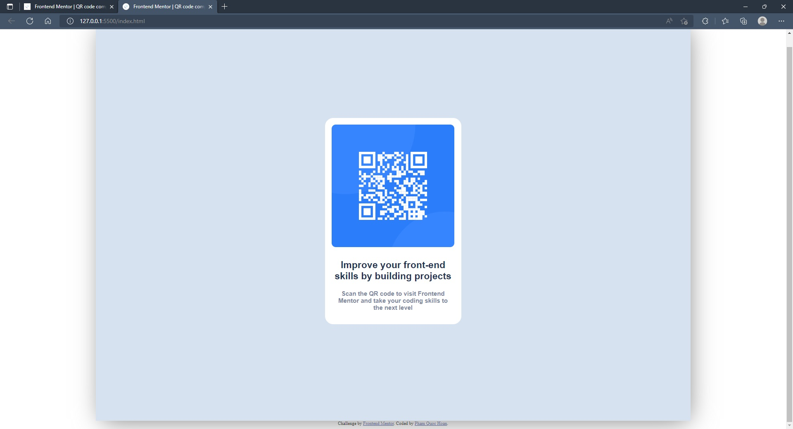

# Frontend Mentor - QR code component solution

This is a solution to the [QR code component challenge on Frontend Mentor](https://www.frontendmentor.io/challenges/qr-code-component-iux_sIO_H). Frontend Mentor challenges help you improve your coding skills by building realistic projects.

## Table of contents

-   [Overview](#overview)
    -   [Screenshot](#screenshot)
    -   [Links](#links)
-   [My process](#my-process)
    -   [Built with](#built-with)
    -   [What I learned](#what-i-learned)
    -   [Continued development](#continued-development)
    -   [Useful resources](#useful-resources)
-   [Author](#author)
-   [Acknowledgments](#acknowledgments)

**Note: Delete this note and update the table of contents based on what sections you keep.**

## Overview

### Screenshot



### Links

-   Solution URL: [Add solution URL here](https://your-solution-url.com)
-   Live Site URL: [Add live site URL here](https://your-live-site-url.com)

## My process

### Built with

-   Semantic HTML5 markup
-   CSS custom properties

### What I learned

I have known a several ways to center a div.

To see how you can add code snippets, see below:

```html
<div class="background">
    <div class="container">...</div>
</div>
```

```css
.background {
    width: 1440px;
    height: 100vh;
    background-color: hsl(212, 45%, 89%);
    margin: 0 auto;
    position: relative;
    box-shadow: 5px 10px 60px -10px grey;
}

.container {
    width: 330px;
    height: 500px;
    background-color: hsl(0, 0%, 100%);
    position: absolute;
    top: 50%;
    left: 50%;
    margin-top: -250px;
    margin-left: -165px;
    border-radius: 20px;
}
```

### Continued development

Try to do faster. Know how to make stuff happen.

### Useful resources

-   [Example resource 1](https://www.example.com) - This helped me for XYZ reason. I really liked this pattern and will use it going forward.
-   [Example resource 2](https://www.example.com) - This is an amazing article which helped me finally understand XYZ. I'd recommend it to anyone still learning this concept.

**Note: Delete this note and replace the list above with resources that helped you during the challenge. These could come in handy for anyone viewing your solution or for yourself when you look back on this project in the future.**

## Author

-   Frontend Mentor - [@pqhoan29](https://www.frontendmentor.io/profile/pqhoan29)
-   Twitter - [@_Red_Bread_](https://twitter.com/_Red_Bread_)

## Acknowledgments

Thank me.
